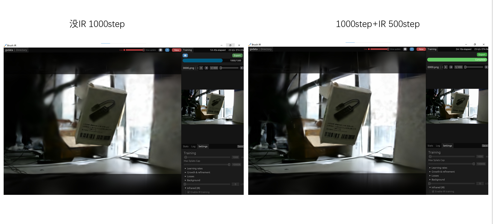
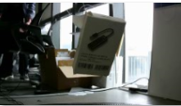
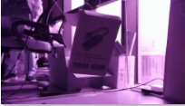
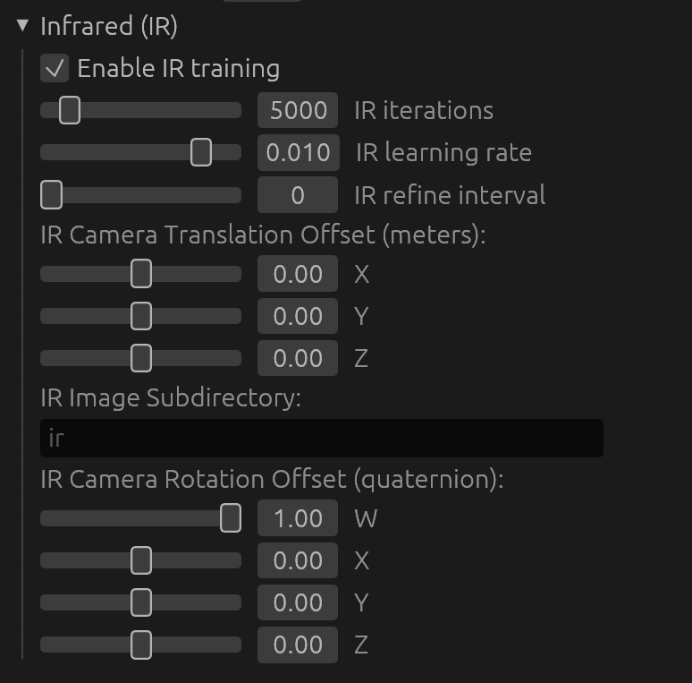
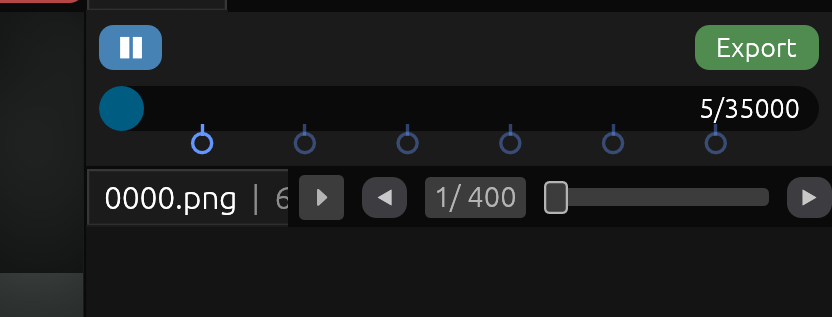
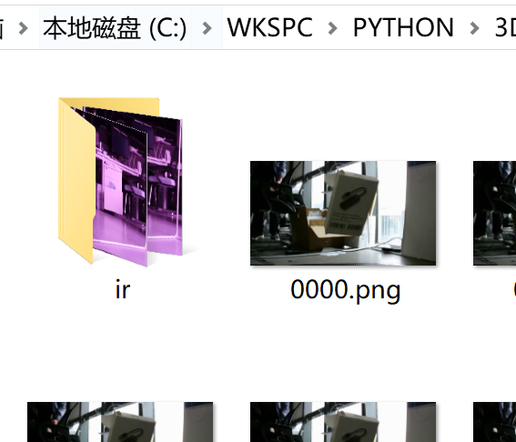
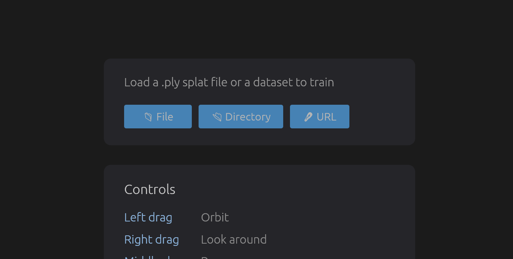
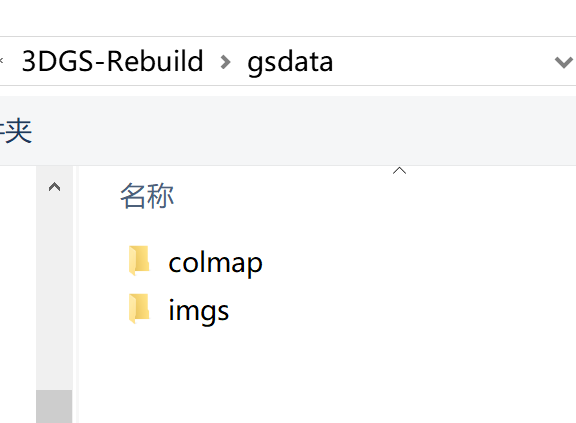
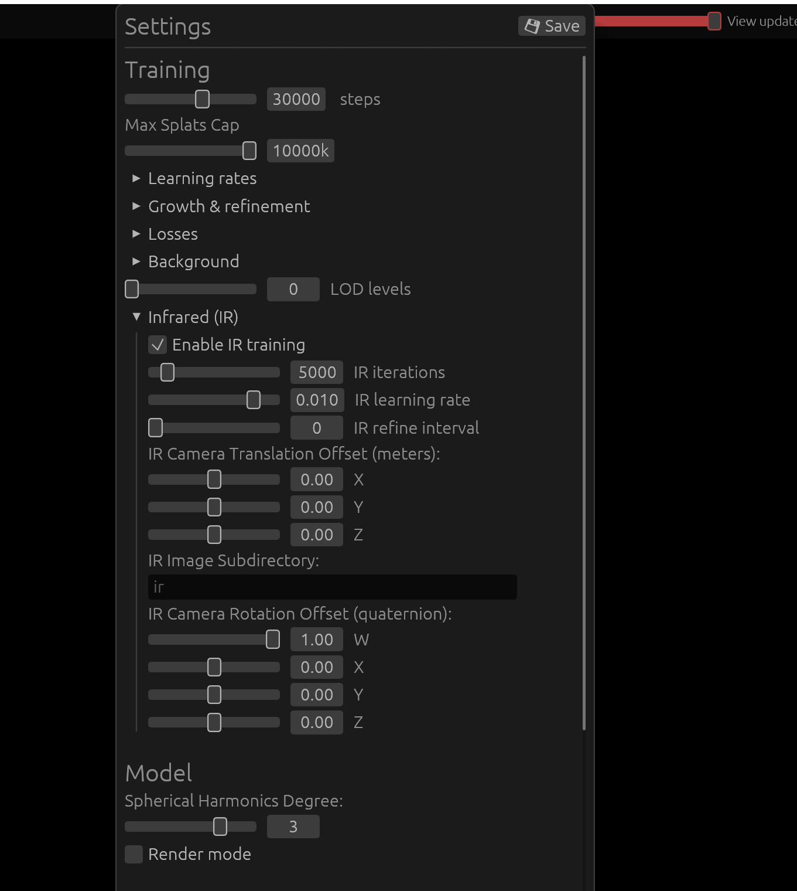
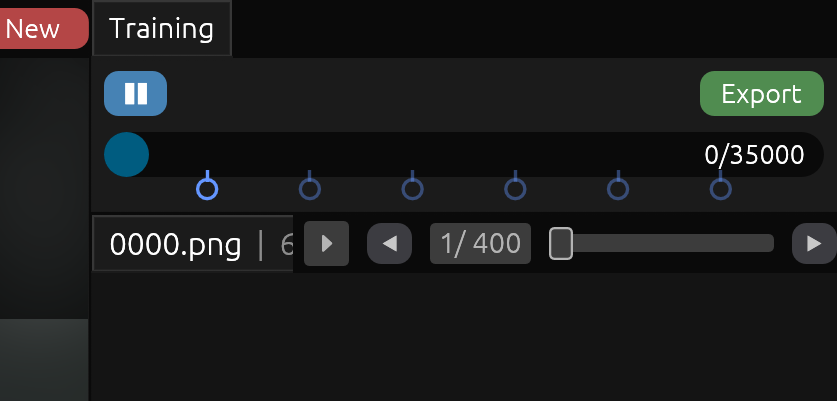

# Brush IR

基于Brush的融合红外与 RGB 双模态图像的三维重建系统

## Features

- 支持红外+RGB双模态输入 
- 可自定义红外相机与RGB相机的偏移距离和角度 
- RGB训练完成后，使用红外数据进行位置强化 

## Usage

- 将NIR数据集放在RGB图片的子目录下 
- 选择Directory，加载一个包含colmap、RGB图集、IR图集的文件夹  
- 勾选Enable IR training，设置参数 
- Start！ 

## Build

与[brush](https://github.com/ArthurBrussee/brush)完全相同，以Windows/macOS/Linux为例：

Use `cargo run --release` from the workspace root to make an optimized build. Use `cargo run` to run a debug build.

## Acknowledgements

Based on [brush](https://github.com/ArthurBrussee/brush)